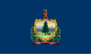

# US States Time Display

## Description

US States Time Display is a web application that allows users to view and manage the current time in various states across the USA. Users can add new states, view their local time, and toggle between 12-hour and 24-hour time formats.

## Features

- **Add States**: Add any US state to the list and see its current local time.
- **Time Formats**: Toggle between 12-hour and 24-hour time formats for a customized view.
- **Interactive Interface**: A user-friendly interface to manage and view state times.
- **Search Feature**: Allows users to search for states easily using a search button with SVG.

## Resources

- **SVG Icon Source**: The SVG icon for the search button is sourced from [SVG Repo](https://www.svgrepo.com/svg/528832/add-circle).
- **Favicon**: The US flag emoji favicon is sourced from [Favicon.io](https://favicon.io/emoji-favicons/flag-united-states/).
- **Google Font**: The font "Fredoka" is sourced from [Google Fonts](https://fonts.google.com/specimen/Fredoka).

## Flags

Flags were obtained from [Wikimedia Commons](https://commons.wikimedia.org).

### Flags of US States

| | | |
|--------------------------|---------------------------|---------------------------|
|  [Alabama](https://commons.wikimedia.org/wiki/File:Flag_of_Alabama.svg)             |  [Louisiana](https://commons.wikimedia.org/wiki/File:Flag_of_the_State_of_Louisiana.svg) |  [Ohio](https://commons.wikimedia.org/wiki/File:Flag_of_Ohio.svg)                              |
|  [Alaska](https://commons.wikimedia.org/wiki/File:Flag_of_Alaska.svg)                |  [Maine](https://commons.wikimedia.org/wiki/File:Flag_of_the_State_of_Maine.svg)             |  [Oklahoma](https://commons.wikimedia.org/wiki/File:Flag_of_Oklahoma.svg)                  |
|  [Arizona](https://commons.wikimedia.org/wiki/File:Flag_of_Arizona.svg)             |  [Maryland](https://commons.wikimedia.org/wiki/File:Flag_of_Maryland.svg)                 |  [Oregon](https://commons.wikimedia.org/wiki/File:Flag_of_Oregon.svg)                        |
|  [Arkansas](https://commons.wikimedia.org/wiki/File:Flag_of_Arkansas.svg)          |  [Massachusetts](https://commons.wikimedia.org/wiki/File:Flag_of_Massachusetts.svg)  |  [Pennsylvania](https://commons.wikimedia.org/wiki/File:Flag_of_Pennsylvania.svg)      |
|  [California](https://commons.wikimedia.org/wiki/File:Flag_of_California.svg)    |  [Michigan](https://commons.wikimedia.org/wiki/File:Flag_of_Michigan.svg)                 |  [Rhode Island](https://commons.wikimedia.org/wiki/File:Flag_of_Rhode_Island.svg)       |
|  [Colorado](https://commons.wikimedia.org/wiki/File:Flag_of_Colorado.svg)          |  [Minnesota](https://commons.wikimedia.org/wiki/File:Flag_of_Minnesota.svg)              |  [South Carolina](https://commons.wikimedia.org/wiki/File:Flag_of_South_Carolina.svg) |
|  [Connecticut](https://commons.wikimedia.org/wiki/File:Flag_of_Connecticut.svg) |  [Mississippi](https://commons.wikimedia.org/wiki/File:Flag_of_Mississippi.svg)        |  [South Dakota](https://commons.wikimedia.org/wiki/File:Flag_of_South_Dakota.svg)       |
|  [Delaware](https://commons.wikimedia.org/wiki/File:Flag_of_Delaware.svg)          |  [Missouri](https://commons.wikimedia.org/wiki/File:Flag_of_Missouri.svg)                 |  [Tennessee](https://commons.wikimedia.org/wiki/File:Flag_of_Tennessee.svg)               |
|  [Florida](https://commons.wikimedia.org/wiki/File:Flag_of_Florida.svg)             |  [Montana](https://commons.wikimedia.org/wiki/File:Flag_of_Montana.svg)                    |  [Texas](https://commons.wikimedia.org/wiki/File:Flag_of_Texas.svg)                           |
|  [Georgia](https://commons.wikimedia.org/wiki/File:Flag_of_the_State_of_Georgia.svg)|  [Nebraska](https://commons.wikimedia.org/wiki/File:Flag_of_Nebraska.svg)                 |  [Utah](https://commons.wikimedia.org/wiki/File:Flag_of_Utah.svg)                              |
|  [Hawaii](https://commons.wikimedia.org/wiki/File:Flag_of_Hawaii.svg)                |  [Nevada](https://commons.wikimedia.org/wiki/File:Flag_of_Nevada.svg)                       |  [Vermont](https://commons.wikimedia.org/wiki/File:Flag_of_Vermont.svg)                     |
|  [Idaho](https://commons.wikimedia.org/wiki/File:Flag_of_Idaho.svg)                   |  [New Hampshire](https://commons.wikimedia.org/wiki/File:Flag_of_New_Hampshire.svg)   |  [Virginia](https://commons.wikimedia.org/wiki/File:Flag_of_Virginia.svg)                  |
|  [Illinois](https://commons.wikimedia.org/wiki/File:Flag_of_Illinois.svg)          |  [New Jersey](https://commons.wikimedia.org/wiki/File:Flag_of_New_Jersey.svg)            |  [Washington](https://commons.wikimedia.org/wiki/File:Flag_of_Washington.svg)            |
|  [Indiana](https://commons.wikimedia.org/wiki/File:Flag_of_Indiana.svg)             |   [New Mexico](https://commons.wikimedia.org/wiki/File:Flag_of_New_Mexico.svg)           |  [West Virginia](https://en.wikipedia.org/wiki/File:Flag_of_West_Virginia.svg)         | 
|  [Iowa](https://commons.wikimedia.org/wiki/File:Flag_of_Iowa.svg)                      |  [New York](https://commons.wikimedia.org/wiki/File:Flag_of_New_York.svg)                  |  [Wisconsin](https://commons.wikimedia.org/wiki/File:Flag_of_Wisconsin.svg)               |
|  [Kansas](https://commons.wikimedia.org/wiki/File:Flag_of_Kansas.svg)                |  [North Carolina](https://commons.wikimedia.org/wiki/File:Flag_of_North_Carolina.svg)|   [Wyoming](https://commons.wikimedia.org/wiki/File:Flag_of_Wyoming.svg)                    |
|  [Kentucky](https://commons.wikimedia.org/wiki/File:Flag_of_Kentucky.svg)          |  [North Dakota](https://commons.wikimedia.org/wiki/File:Flag_of_North_Dakota.svg)      | 